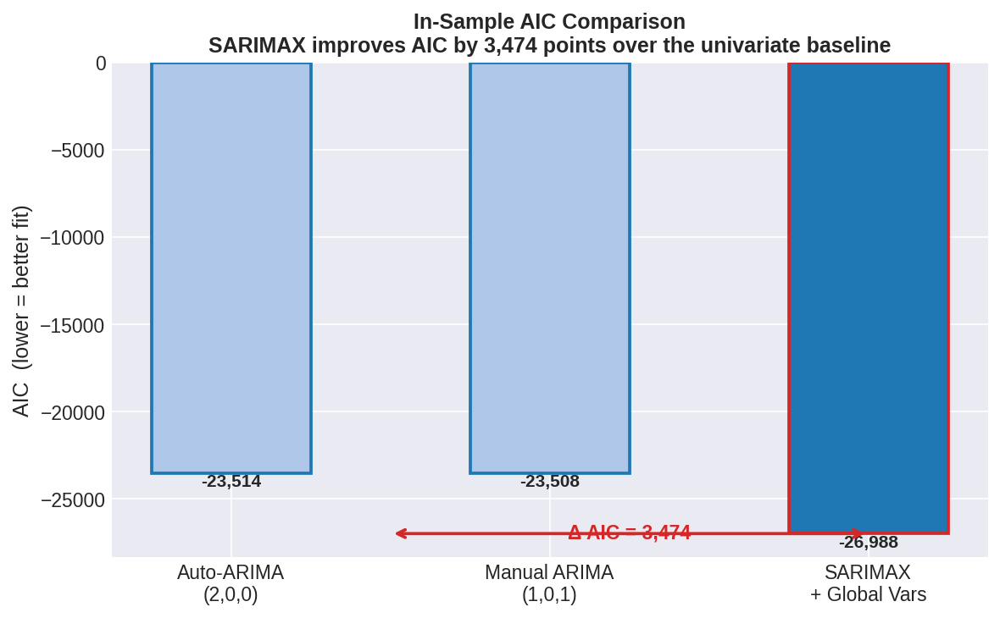
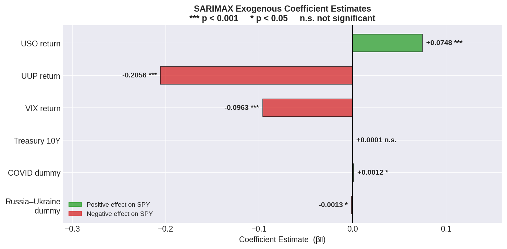
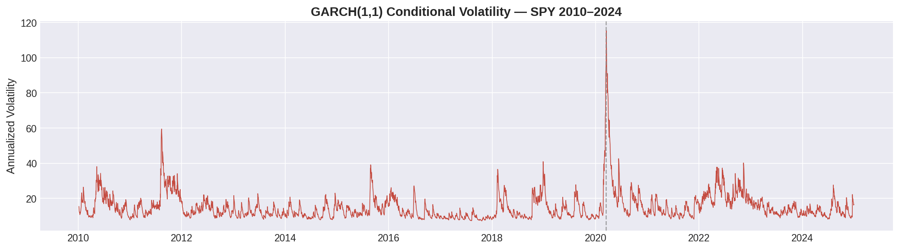
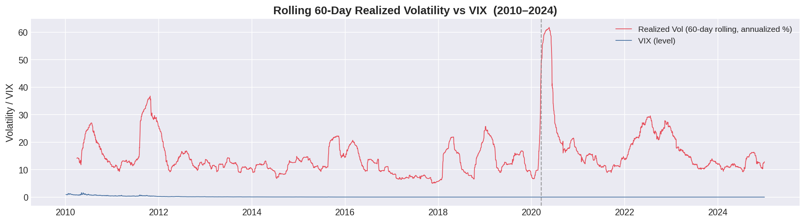
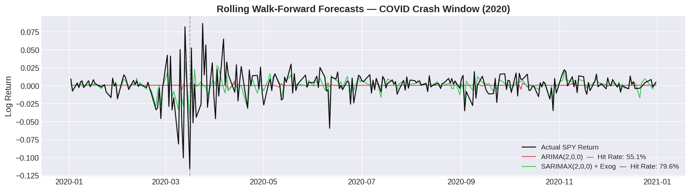
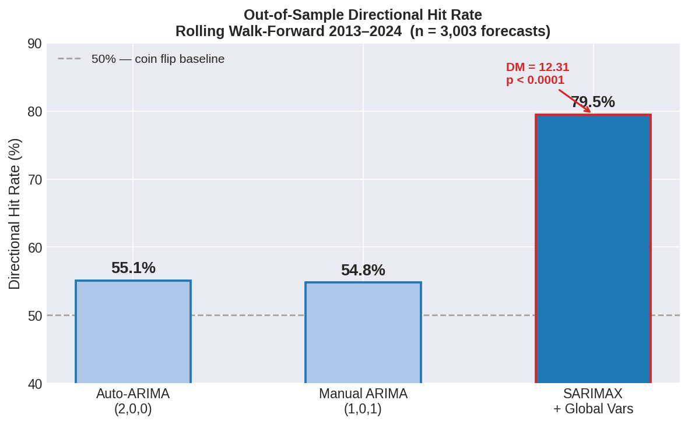
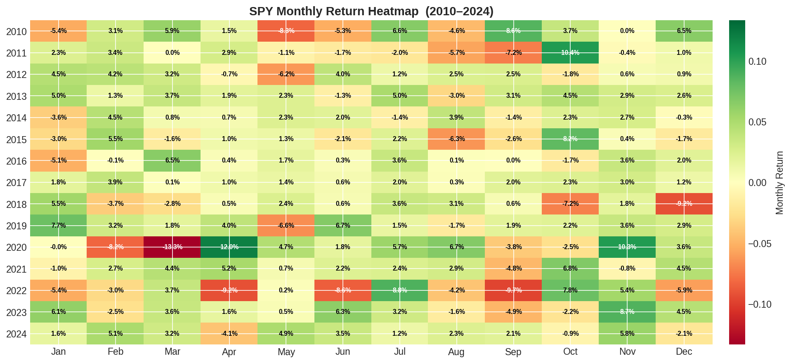
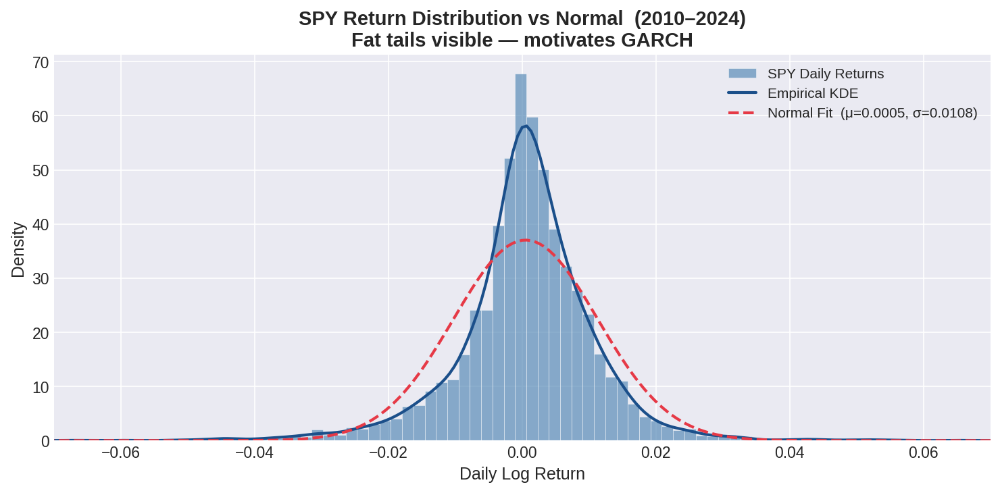

# 📈 Global Market Linkages & U.S. Equity Forecasting

This project builds a SARIMAX + GARCH(1,1) forecasting pipeline for next-day S&P 500 (SPY) returns using international market signals — oil prices, dollar strength, implied volatility, sovereign yields, and geopolitical event dummies. Validated over 3,003 out-of-sample forecasts with 79.5% directional accuracy and a Diebold-Mariano statistic of 12.31 (p < 0.0001).

## 🔍 Overview

- **Target variable:** SPY daily log returns (2010–2024)
- **Exogenous signals:** USO (oil), UUP (dollar), VIX (fear), 10Y Treasury yield, COVID dummy, Ukraine dummy
- **Model:** SARIMAX(2,0,0) + Global Exog Vars, residuals modeled with GARCH(1,1)
- **Validation:** Rolling walk-forward, 143 expanding windows, 3,003 out-of-sample forecasts
- **Tools:** Python, statsmodels, arch, yfinance, pandas-datareader, matplotlib, Streamlit

## 🗂️ Repository Structure

```
global-market-linkages-spy-forecasting/
├── data/
│   ├── raw/                    # Raw Yahoo Finance & FRED downloads
│   └── processed/              # Cleaned, merged, return-transformed data
├── notebooks/
│   ├── 01_data_collection.ipynb
│   ├── 02_eda_stationarity.ipynb
│   ├── 03_sarimax_estimation.ipynb
│   ├── 04_garch_volatility.ipynb
│   └── 05_walk_forward_validation.ipynb
├── src/
│   ├── data_pipeline.py
│   ├── sarimax_model.py
│   ├── garch_model.py
│   └── evaluation.py
├── plots/                      # Figures plot_18 through plot_25
├── streamlit_app/app.py
├── docs/
│   ├── capstone_paper.pdf
│   └── presentation_slides.pdf
├── requirements.txt
└── README.md
```

## 📊 Key Visualizations

### Model Selection

AIC-based comparison across univariate ARIMA baselines and the full SARIMAX specification. SARIMAX + Global Vars achieves AIC = −26,988, a **3,474-point improvement** over the Manual ARIMA baseline — confirming that global market signals carry real in-sample explanatory power.



---

### SARIMAX Coefficients

Estimated exogenous coefficients from SARIMAX(2,0,0) + Global Vars. Oil returns (USO: +0.0748***) are positively associated with SPY, while dollar strength (UUP: −0.2056***) and implied volatility (VIX: −0.0963***) exert significant negative pressure. Geopolitical dummies (COVID, Ukraine) are statistically significant but economically small.



---

### Volatility Modeling

#### GARCH(1,1) Conditional Volatility

GARCH(1,1) fitted on SARIMAX residuals captures the volatility clustering characteristic of financial returns. Persistence parameter α + β = **0.968**, consistent with near-unit-root variance dynamics. The March 2020 COVID crash spike (>115% annualized) is the defining structural event of the sample.



#### Rolling 60-Day Realized Volatility vs VIX

Realized volatility (60-day rolling, annualized) tracked against the VIX level across the full sample. The 2020 COVID crash produces a sharp spike in realized vol that exceeds all prior episodes, validating the inclusion of the COVID dummy in the SARIMAX specification.



---

### Forecasting Performance

#### COVID Crash Window (2020)

Rolling walk-forward forecasts during the highest-volatility period in the sample. SARIMAX + Global Vars (green) achieves a **79.6% hit rate** during this window, dramatically outperforming the ARIMA(2,0,0) baseline (red, 55.1%) even amid unprecedented daily swings.



#### Out-of-Sample Directional Hit Rate

Across all 143 rolling windows (3,003 forecasts, 2013–2024), SARIMAX + Global Vars achieves **79.5% directional accuracy** — compared to 55.1% for Auto-ARIMA and 54.8% for Manual ARIMA. The Diebold-Mariano test rejects forecast equality at DM = 12.31, p < 0.0001.



---

### EDA

#### SPY Monthly Return Heatmap (2010–2024)

Month-by-month SPY returns across the full sample period. The 2020 COVID crash (March: −13.3%) and recovery (April: +12.9%) stand out as the most extreme consecutive months in the dataset. The heatmap also reveals the well-documented October seasonality and the 2022 rate-hike drawdown.



#### SPY Return Distribution vs Normal

SPY daily log returns exhibit pronounced excess kurtosis (fat tails) relative to the fitted normal distribution. This leptokurtosis — visible in both the histogram and the KDE vs. normal fit — directly motivates the GARCH(1,1) specification for volatility modeling.



---

## 🏆 Results Summary

| Metric | SARIMAX + Global Vars | Auto-ARIMA (2,0,0) | Manual ARIMA (1,0,1) |
|---|---|---|---|
| **Directional Hit Rate** | **79.5%** | 55.1% | 54.8% |
| **In-Sample AIC** | **−26,988** | −23,514 | −23,508 |
| **DM Statistic** | **12.31** | — | — |
| **DM p-value** | **< 0.0001** | — | — |
| **GARCH Persistence (α+β)** | **0.968** | — | — |
| **Forecast Windows** | 143 | 143 | 143 |
| **Out-of-Sample Forecasts** | 3,003 | 3,003 | 3,003 |

> **Directional hit rate** is defined as the proportion of out-of-sample forecasts correctly predicting the sign of next-day SPY returns (Pesaran-Timmermann, 1992). The Diebold-Mariano (1995) test rejects forecast equality between SARIMAX and the naïve random-walk baseline.

## 🛠️ Tech Stack

| Category | Tools |
|---|---|
| **Language** | Python 3.10+ |
| **Forecasting** | `statsmodels` (SARIMAX), `arch` (GARCH) |
| **Data** | `yfinance`, `pandas-datareader`, FRED API |
| **Analysis** | `pandas`, `numpy`, `scipy` |
| **Visualization** | `matplotlib`, `seaborn` |
| **Dashboard** | `streamlit` |
| **Paper** | LaTeX (Overleaf) |

## ⚡ Quickstart

```bash
# Clone
git clone https://github.com/mshahryar024/global-market-linkages-spy-forecasting.git
cd global-market-linkages-spy-forecasting

# Install dependencies
pip install -r requirements.txt

# Run full pipeline
python src/data_pipeline.py
python src/sarimax_model.py
python src/garch_model.py
python src/evaluation.py

# Launch dashboard
cd streamlit_app && streamlit run app.py
```

## 🖥️ Live Dashboard

> **[🚀 Launch Dashboard →](https://your-streamlit-link-here.streamlit.app)**

Explore out-of-sample forecasts vs. realized returns, window-by-window hit rates, GARCH conditional volatility, and geopolitical event overlays — all interactive.

## 📜 Citation

```bibtex
@thesis{shahryar2026globalmarket,
  title   = {Global Market Linkages and Forecasting U.S. Equity Returns},
  author  = {Shahryar, Muhammad},
  year    = {2026},
  school  = {Knox College},
  type    = {Data Science Capstone},
  advisor = {Forsberg, Ole}
}
```

## 📬 Contact

**Muhammad Shahryar** · Knox College, Class of 2026 — Data Science & Economics  
📧 sheryr8@gmail.com · 📍 Chicago, IL  
[](https://github.com/mshahryar024)

---

*Built to test whether global markets price U.S. risk before U.S. markets do.*
